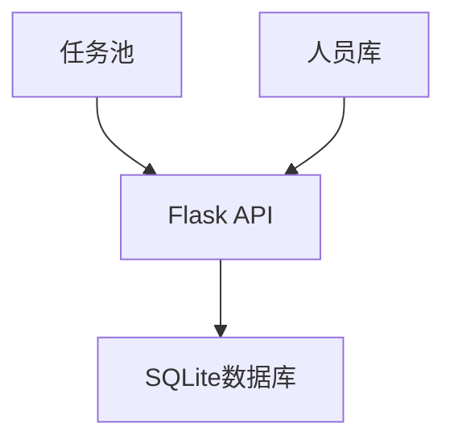
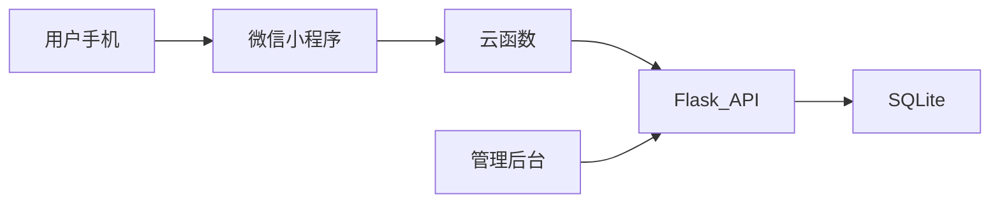

一个**渐进式开发框架**，充分利用现有AI工具链与Python生态，最大限度降低前端复杂度。以下是分模块实现方案：

---

### **一、技术选型建议**
| 模块          | 推荐方案                          | 替代方案（备用）              | 优势分析                                                                 |
|---------------|-----------------------------------|-----------------------------|--------------------------------------------------------------------------|
| **后端**      | Flask + SQLAlchemy（Python）      | FastAPI                     | 轻量易上手，适合中小型项目                                               |
| **数据库**    | SQLite（开发）/ PostgreSQL（生产） | MySQL                       | SQLite零配置，Python原生支持                                             |
| **前端**      | Streamlit（Python）               | Vue.js + ElementUI（JS）    | 用Python写Web界面，避免复杂JS开发                                         |
| **移动端**    | 微信小程序（云开发）                | Appsmith低代码平台           | 利用微信生态，云开发免运维                                                |
| **AI能力**    | ChatGPT API + 百度OCR             | 阿里云视觉智能                | 快速集成NLP生成任务描述、OCR验收图片识别                                  |
| **部署**      | Docker + Nginx                    | 宝塔面板                     | 容器化便于迁移                                                           |

---

### **二、分模块实现路径**
#### **阶段1：搭建核心骨架（2周）**


1. **数据库设计（DDL示例）**
```python
# models.py
class Task(Base):
    __tablename__ = 'tasks'
    id = Column(Integer, primary_key=True)
    title = Column(String(50))  # 任务名称
    type = Column(Enum('周期', '突发')) 
    cycle_days = Column(Integer)  # 周期天数（仅周期任务需要）
    skills_required = Column(JSON)  # 所需技能标签，如["绿化", "紧急"]
    status = Column(Enum('待分配', '执行中', '已完成', '已取消'))

class Staff(Base):
    __tablename__ = 'staffs'
    id = Column(Integer, primary_key=True)
    name = Column(String(20))
    skills = Column(JSON)  # 技能标签，如["电工", "绿化"]
    current_tasks = Column(JSON)  # 当前任务ID列表
```

2. **基础API开发（Flask示例）**
```python
@app.route('/api/tasks', methods=['POST'])
def create_task():
    # 使用ChatGPT API自动生成任务描述（增强体验）
    desc = openai.ChatCompletion.create(
        model="gpt-3.5-turbo",
        messages=[{"role": "user", "content": f"生成物业任务描述：类型{request.json['type']}，关键词{request.json['keywords']}"}]
    )
    new_task = Task(description=desc.choices[0].message.content)
    db.session.add(new_task)
    db.session.commit()
    return jsonify({"msg": "任务创建成功"})
```

---

#### **阶段2：实现智能分配（3周）**
**核心逻辑：基于规则的优先级排序**
```python
# scheduler.py
def assign_task(task):
    # 步骤1：筛选具备技能的员工
    qualified_staffs = Staff.query.filter(
        Staff.skills.contains_any(task.skills_required)
    ).all()

    # 步骤2：计算空闲指数（当前任务数倒数）
    staff_load = {s.id: 1/(len(s.current_tasks)+0.1) for s in qualified_staffs}

    # 步骤3：选择最闲员工
    best_staff_id = max(staff_load, key=staff_load.get)
    
    # 更新任务状态
    task.assigned_to = best_staff_id
    task.status = '执行中'
    db.session.commit()
```

**增强方案（可选）：**
- 接入**腾讯云函数**定时触发周期任务生成
- 用**Pandas**分析历史数据优化分配权重

---

#### **阶段3：开发管理界面（2周）**
使用Streamlit快速构建可视化后台：
```python
# admin.py
import streamlit as st

def show_dashboard():
    # 任务状态饼图
    task_stats = db.session.query(Task.status, func.count(Task.id)).group_by(Task.status).all()
    status_df = pd.DataFrame(task_stats, columns=['状态', '数量'])
    st.altair_chart(alt.Chart(status_df).mark_bar().encode(
        x='状态', y='数量', color='状态'
    ))
    
    # 手动分配界面
    with st.form("手动分配"):
        task_id = st.selectbox("选择任务", get_unassigned_tasks())
        staff_id = st.selectbox("选择员工", get_qualified_staff(task_id))
        if st.form_submit_button("分配"):
            assign_manually(task_id, staff_id)
```

---

#### **阶段4：移动端对接（2周）**
**方案A（推荐）：微信小程序 + 云函数**
```javascript
// 小程序端任务列表示例
Page({
  data: { tasks: [] },
  onLoad() {
    wx.cloud.callFunction({
      name: 'getMyTasks',
      success: res => this.setData({ tasks: res.result })
    })
  },
  // 拍照验收
  uploadPhoto() {
    wx.chooseImage({
      success: res => wx.cloud.uploadFile({
        cloudPath: `验收/${Date.now()}.jpg`, 
        filePath: res.tempFilePaths[0]
      })
    })
  }
})
```

**方案B（备用）：用Appsmith拖拽搭建**
- 直接连接数据库生成CRUD界面
- 内置地图组件显示任务位置

---

### **三、关键问题解决方案**
#### **难点1：前端交互复杂度**
- **应对策略**：  
  - 使用Streamlit/Vue.js组件库（如AG-Grid）快速实现表格交互  
  - 复杂表单采用分步引导（如创建任务时先选类型再填详情）

#### **难点2：实时状态更新**
- **技术方案**：  
  ```python
  # 后端推送技术选型
  if 需要实时性高:
      使用WebSocket（Flask-SocketIO）
  else:
      前端轮询（每60秒刷新）
  ```

#### **难点3：分配算法优化**
- **迭代路径**：  
  1. 初期：基于规则的硬编码逻辑（如技能匹配优先）  
  2. 中期：引入权重配置（在管理界面开放权重调整滑块）  
  3. 后期：接入机器学习库（如scikit-learn）预测任务耗时

---

### **四、部署与维护**
#### **最低可行架构**


#### **自动化方案**
1. 用GitHub Actions实现CI/CD：  
   - 自动运行单元测试（pytest）  
   - 代码合并后触发Docker镜像构建  
2. 监控报警：  
   - 使用UptimeRobot监控API可用性  
   - 异常时发送邮件通知

---

### **五、你的学习聚焦点**
根据项目需求，建议优先补充：
1. **JavaScript速成**（仅需掌握）：  
   - ES6基础语法（变量/函数/Promise）  
   - 微信小程序开发框架（WXML/WXSS）  
   - 每日1小时，推荐《JavaScript高级程序设计》第4-6章精读  

2. **Streamlit深度使用**：  
   - 布局组件（st.columns/st.expander）  
   - 状态管理（Session State）  
   - 官方文档案例实践：https://docs.streamlit.io  

3. **ChatGPT API进阶**：  
   - Function Calling实现结构化输出  
   - 用自然语言生成SQL查询（减少手写SQL）

---

### **六、开发里程碑计划**
| 周次 | 目标                          | 交付物                      | 验证方式                     |
|------|-------------------------------|---------------------------|----------------------------|
| 1-2  | 核心数据模型与API             | 可创建任务/员工的基础系统    | Postman测试CRUD接口         |
| 3-4  | 实现自动分配逻辑               | 命令行演示任务分配过程       | 输入测试任务查看分配日志     |
| 5-6  | 管理后台可视化                 | 可通过网页查看任务状态       | 实际录入数据并操作          |
| 7-8  | 移动端对接                    | 员工能用小程序接收简单任务   | 真机测试拍照上传            |
| 9-10 | 数据分析报表                  | 生成月度人员效率对比图       | 导入历史数据验证准确性       |

建议从「阶段1」开始，每完成一个模块即手动测试验证，**避免过度设计**。遇到具体技术卡点时，可随时告知，我将提供针对性代码示例。