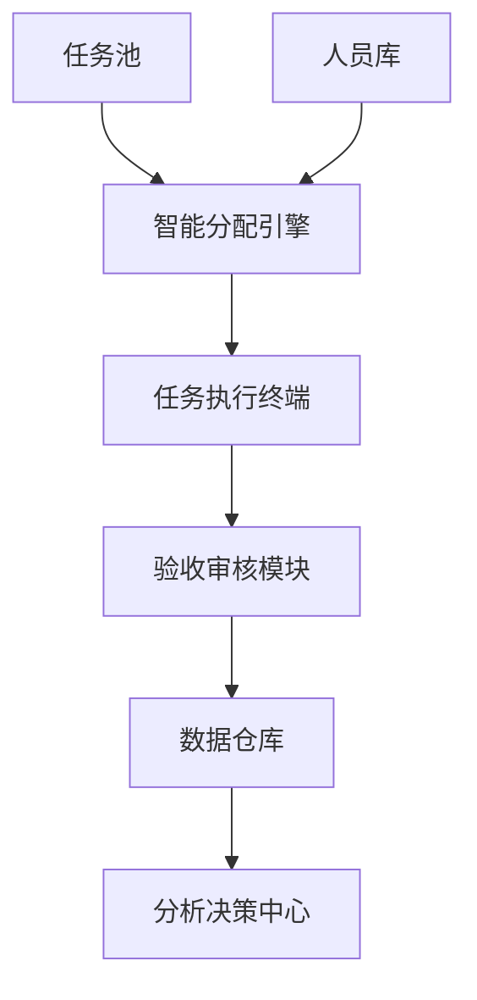

以下是整合您初始构想与补充建议后形成的完整项目方案框架，供您进一步细化或向团队/上级汇报：

---

# **物业任务智能管理系统（PM-TIMS）项目方案**

## **一、项目背景与目标**
### **1.1 痛点分析**
- 周期性任务依赖人工记忆分配，效率低且易遗漏
- 突发任务响应迟缓，缺乏标准化处理流程
- 人员技能与任务匹配度依赖主观判断，易出现分配不均
- 工作成果评估缺乏数据支撑，绩效考核主观性强

### **1.2 核心目标**
- **效率提升**：自动化处理80%周期性任务，减少50%人工调度时间
- **风险可控**：建立应急任务响应机制，关键任务延误率降低70%
- **决策优化**：通过历史数据反哺任务周期调整与资源配置

---

## **二、系统核心架构**


### **2.1 功能模块设计**
#### **模块1：任务池管理**
- **任务类型**  
  - 周期性任务：支持按日/周/月/季循环，自动生成任务链  
  - 突发任务：通过模板快速生成（5秒录入原则）  
  - 应急预案：关联天气/设备传感器自动触发任务  
- **智能标签体系**  
  - 优先级标签：紧急度（红/黄/绿）、影响范围（全局/局部）  
  - 任务属性：技能要求（水电/绿化/安保）、预计耗时、风险等级  

#### **模块2：人员库管理**
- **三维度人员画像**  
  - 基础信息：岗位、工龄、证书  
  - 能力标签：专业技能（如园艺修剪3级）、可兼职岗位  
  - 动态状态：当前任务数、未来3天负载预测、历史完成评分  
- **弹性调度机制**  
  - 自动分配：按“技能匹配度+实时负载+历史表现”综合算法派单  
  - 人工干预：允许紧急情况下手动指定或任务转派  

#### **模块3：智能分配引擎**
- **动态平衡算法**  
  ```python
  # 伪代码示例：任务分配权重计算
  def 分配权重(员工):
      return (技能匹配度 * 0.6) + (空闲指数 * 0.3) + (历史评分 * 0.1)
  ```
- **冲突解决机制**  
  - 任务重叠预警：自动检测同一人员的时间冲突任务  
  - 智能拆解：将复杂任务拆解为子任务并行分配  

#### **模块4：全流程监控**
- **生命周期追踪**  
  ```mermaid
  flowchart LR
    创建任务 --> 分配 --> 执行中 --> 完成/取消 --> 验收 --> 归档
  ```
- **异常处理**  
  - 超时任务：提前2小时预警并启动备选方案  
  - 任务取消：记录原因分类（天气/资源不足/客户变更）  

#### **模块5：数据分析中心**
- **核心看板**  
  - 人员效能热力图：展示各岗位工作饱和度与完成质量  
  - 任务成本分析：对比同类任务耗时与资源消耗差异  
- **智能报告**  
  - 自动生成月度人员KPI报告（完成量/及时率/客户评分）  
  - 任务周期优化建议（如绿化施肥频率从每月调整为28天）  

---

## **三、实施路径**
### **3.1 阶段规划**
| 阶段 | 周期 | 目标 | 交付物 |
|------|------|------|--------|
| **试点期** | 1-2月 | 验证核心逻辑 | 单小区任务池+移动端任务推送 |
| **优化期** | 3-4月 | 完善算法模型 | 负载预测模型+智能分配引擎 |
| **推广期** | 5-6月 | 全区域覆盖 | 多项目管理+应急联动模块 |

### **3.2 低成本启动方案**
- **工具选型**  
  - 任务管理：用钉钉宜搭搭建任务池，设置自动化提醒规则  
  - 人员调度：通过飞书多维表格实现技能标签与任务匹配  
  - 移动端：企业微信集成拍照打卡、定位签到功能  
- **渐进开发**  
  - 初期：人工审核+系统辅助分配  
  - 中期：引入规则引擎实现半自动分配  
  - 长期：开发定制化AI调度系统  

---

## **四、风险与应对**
| 风险类型 | 应对措施 |
|----------|----------|
| **员工抵触** | 设计积分奖励机制，任务完成速度/质量兑换实物奖励 |
| **系统误判** | 保留「人工申诉-系统自学习」闭环，错误分配反馈后优化算法 |
| **数据泄露** | 通过私有化部署+权限分级（如维修员仅见自身任务） |

---

## **五、预期收益**
| 指标 | 现状 | 系统上线后目标 |
|------|------|----------------|
| 任务分配耗时 | 2小时/天 | ≤0.5小时/天 |
| 突发任务响应速度 | 平均4小时 | ≤1小时 |
| 人员闲置率 | 约15% | ≤5% |
| 客户投诉率 | 每月8-10起 | ≤3起 |

---

该方案可作为向技术团队提需求的蓝本，或向管理层申请资源的汇报框架。建议优先开发**任务池+移动端执行模块**，快速验证核心价值后再迭代复杂功能。如果需要更详细的技术规格书或UI原型设计，我可进一步提供细化建议。