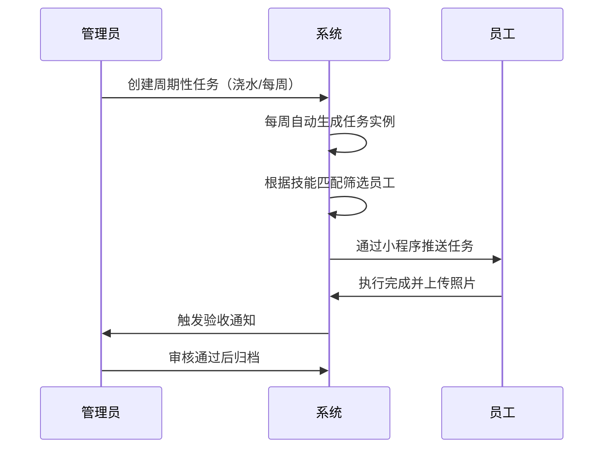

以下是针对该项目的详细运行流程设计，结合你的技术栈分步骤说明关键操作节点：

---

### **一、系统初始化流程**
#### **1. 环境准备**
```bash
# 创建项目目录
mkdir pm-tims && cd pm-tims

# 安装依赖
python -m venv venv
source venv/bin/activate  # Windows用 venv\Scripts\activate
pip install flask sqlalchemy streamlit openai
```

#### **2. 数据库初始化**
```python
# app/models.py
from flask_sqlalchemy import SQLAlchemy

db = SQLAlchemy()

class Task(db.Model):
    id = db.Column(db.Integer, primary_key=True)
    title = db.Column(db.String(100))
    task_type = db.Column(db.Enum('周期', '突发'))
    cycle_days = db.Column(db.Integer, nullable=True)
    skills_required = db.Column(db.JSON)  # 例如 ["绿化", "紧急"]
    assigned_to = db.Column(db.Integer, db.ForeignKey('staff.id'))

class Staff(db.Model):
    id = db.Column(db.Integer, primary_key=True)
    name = db.Column(db.String(50))
    skills = db.Column(db.JSON)  # 例如 ["电工", "木工"]
```

```bash
# 初始化数据库
flask shell
>>> from app import db
>>> db.create_all()
```

---

### **二、核心任务流转流程**


#### **1. 创建周期性任务**
```python
# 后端API示例：/api/tasks (POST)
{
    "title": "绿化浇水",
    "type": "周期",
    "cycle_days": 7,
    "skills_required": ["绿化"],
    "locations": ["A区花坛", "B区草坪"]
}

# 定时任务生成（使用APScheduler）
from apscheduler.schedulers.background import BackgroundScheduler

def generate_recurring_tasks():
    recurring_tasks = Task.query.filter(Task.task_type == '周期').all()
    for task in recurring_tasks:
        new_task = Task(
            title=task.title,
            task_type='周期实例',
            skills_required=task.skills_required
        )
        db.session.add(new_task)
    db.session.commit()

scheduler = BackgroundScheduler()
scheduler.add_job(generate_recurring_tasks, 'cron', day_of_week='mon')  # 每周一生成
scheduler.start()
```

#### **2. 突发任务快速录入**
```python
# Streamlit管理界面简化操作
import streamlit as st

task_templates = {
    "地面维修": {"skills": ["泥瓦"], "steps": ["勘察现场", "准备材料", "施工", "清理"]},
    "管道疏通": {"skills": ["水电"], "steps": [...]}
}

template = st.selectbox("选择任务模板", list(task_templates.keys()))
if st.button("生成任务"):
    new_task = Task(
        title=template,
        task_type='突发',
        skills_required=task_templates[template]["skills"]
    )
    db.session.add(new_task)
    st.success("任务已创建！")
```

---

### **三、智能分配执行流程**
#### **1. 自动分配逻辑**
```python
def calculate_staff_score(staff, task):
    # 基础匹配度
    skill_match = len(set(staff.skills) & set(task.skills_required)) / len(task.skills_required)
    
    # 负载因子（当前任务数倒数）
    load_factor = 1 / (len(staff.current_tasks) + 0.1)
    
    # 历史表现（假设有完成率字段）
    performance = staff.completion_rate / 100
    
    return 0.6*skill_match + 0.3*load_factor + 0.1*performance

def auto_assign(task_id):
    task = Task.query.get(task_id)
    candidates = Staff.query.filter(Staff.skills.contains_any(task.skills_required))
    
    if not candidates:
        return {"status": "error", "msg": "无合适人员"}
        
    best_staff = max(candidates, key=lambda x: calculate_staff_score(x, task))
    task.assigned_to = best_staff.id
    db.session.commit()
    
    # 调用微信通知接口
    send_wechat_notify(best_staff.openid, f"新任务：{task.title}")
    
    return {"status": "success"}
```

#### **2. 人工干预流程**
```python
# Streamlit管理界面
staff_list = Staff.query.all()
task = st.selectbox("选择待分配任务", Task.query.filter_by(status='待分配'))

cols = st.columns(2)
with cols[0]:
    st.write("### 系统推荐")
    recommended = auto_assign(task.id)  # 模拟自动分配
    st.write(f"推荐员工：{recommended['name']}")
    
with cols[1]:
    st.write("### 手动选择")
    selected = st.selectbox("员工列表", staff_list)
    if st.button("强制分配"):
        task.assigned_to = selected.id
        db.session.commit()
```

---

### **四、移动端操作流程**
#### **1. 员工任务处理**
```javascript
// 微信小程序端示例代码
Page({
  data: { tasks: [] },
  
  // 获取我的任务
  loadTasks() {
    wx.request({
      url: 'https://your-api.com/tasks/my',
      header: { 'X-User-ID': '123' },
      success: res => this.setData({ tasks: res.data })
    })
  },
  
  // 任务状态更新
  updateTaskStatus(taskId, status) {
    wx.request({
      method: 'POST',
      url: `https://your-api.com/tasks/${taskId}/status`,
      data: { status: status },
      success: () => this.loadTasks()
    })
  },
  
  // 拍照验收
  uploadPhoto() {
    wx.chooseImage({
      count: 1,
      success: res => {
        const tempPath = res.tempFilePaths[0]
        wx.uploadFile({
          url: 'https://your-api.com/upload',
          filePath: tempPath,
          name: 'photo',
          success: () => wx.showToast({ title: '上传成功' })
        })
      }
    })
  }
})
```

---

### **五、数据统计流程**
#### **1. 自动生成月报**
```python
# 使用Pandas分析
def generate_monthly_report():
    # 任务完成情况
    tasks = pd.read_sql(Task.query.statement, db.engine)
    task_stats = tasks.groupby(['task_type', 'status']).size().unstack()
    
    # 员工绩效
    staff_perf = pd.read_sql(Staff.query.statement, db.engine)
    staff_perf['效率分'] = staff_perf.completed_tasks / staff_perf.working_hours
    
    # 生成可视化
    fig = px.bar(task_stats, title="任务状态分布")
    fig.write_image("report.png")
    
    # 调用ChatGPT生成评语
    prompt = f"根据以下数据生成月报总结：{task_stats.to_string()}"
    summary = openai.ChatCompletion.create(...)
    
    return {"chart": fig, "summary": summary}
```

---

### **六、系统维护流程**
#### **1. 日常检查清单**
```bash
# 通过crontab设置定时任务
0 8 * * * curl http://localhost:5000/healthcheck  # 每天8点检查服务状态
0 2 * * * python backup_db.py  # 每日备份数据库

# 日志监控命令
tail -f /var/log/pm-tims/error.log  # 实时查看错误日志
grep "ERROR" /var/log/pm-tims/*.log  # 检索历史错误
```

#### **2. 版本升级流程**
```bash
# 使用Git进行版本控制
git checkout -b v1.1
# 修改代码后...
git add .
git commit -m "优化分配算法"
git tag v1.1
git push origin v1.1

# 生产环境更新
ssh user@server
cd /opt/pm-tims
git fetch
git checkout v1.1
sudo systemctl restart pm-tims
```

---

### **七、关键节点验证表**
| 步骤               | 验证方法                          | 预期结果                     |
|--------------------|---------------------------------|----------------------------|
| 周期性任务生成      | 修改测试任务的周期为1天，观察次日是否自动生成新任务 | 每日0点生成新任务实例        |
| 智能分配           | 创建需要"电工"技能的任务，查看是否分配给技能匹配且空闲的员工 | 任务自动分配给合适人员       |
| 移动端任务推送      | 在小程序登录测试账号，检查任务接收延迟 | 任务分配后5分钟内收到通知    |
| 超时任务处理       | 创建测试任务并设置1小时后超时，不进行操作 | 1小时后系统发送预警邮件      |
| 数据报表生成       | 每月1日检查服务器是否生成report.pdf文件 | 包含图表和文字分析的PDF文件  |

建议在开发过程中持续使用**Postman测试接口**，并用真实物业数据做小规模试运行。每个核心功能模块完成后，立即进行端到端流程测试（如从创建任务到归档的全链路）。